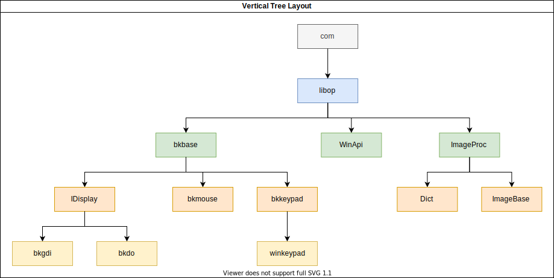

Overview
===========
OP(operator & open)是一个开源插件(类似大漠插件).主要功能有:Windows消息模拟,后台截图，找图,字符识别(OCR)等。使用c++编写，源代码可编译为32/64位dll.op插件提供了两类接口:1）原生c++接口，可以让c/c++开发者方便调用；2）com接口，支持大多数编译型语言(c++,c#,vb,delphi等 以及脚本语言（python,lua等）的调用

## 功能特色
1. Windows消息模拟，常见的键盘消息和鼠标消息模拟。
2. 支持常见的截图方式，gdi,dx（包括d3d9,d3d10,d3d11),opengl截图，支持常见模拟器（雷电，夜神）的最小化截图
3. 找色找图,支持偏色，支持模糊识别
4. 字符识别(OCR),最大支持255 X 255 超大点阵，支持偏色，支持模糊识别，支持系统字库，兼容大漠字库
5. 插件有32位和64位版本，支持32/64位绑定
6. 项目完全开源,无后门无病毒，可放心使用

## Download
包含32位和64位插件，tool工具以及必要的第三方库等文件  
下载地址：[https://github.com/WallBreaker2/op/releases](https://github.com/WallBreaker2/op/releases)  或[gitee](https://gitee.com/wallbreaker2/op/tags)

## 教程  
所有函数说明以及Demo可在以在[wiki](https://github.com/WallBreaker2/op/wiki)或[gitlab](https://gitee.com/wallbreaker2/op/wikis)

## 编译
### 编译环境
* 操作系统: windows 10 64位
* 编译器: vs2019 MSVC2017 32/64
* 工具： cmake 3.0以上
* Windows SDK: 10.0.18362.0 (如果不同，可以在vs项目属性-->常规-->Windows SDk版本手动改一下)
* DirectX SDK: 最新的即可
### 第三方库
* [blackbone](https://github.com/DarthTon/Blackbone.git)(静态编译，链接方式MT)
* [kiero](https://github.com/Rebzzel/kiero.git)(已在源码内，无需安装)
* [minhook](https://github.com/TsudaKageyu/minhook.git)(推荐使用[Vcpkg](https://github.com/Microsoft/vcpkg.git)安装)
* [boost-stacktrace]()(可选，安装使用vcpkg.如果不想安装，注释掉helpfunc.cpp中的宏定义USE_BOOST_STACK_TRACE即可)

## 交流
* 提交issue
* 加入qq群:693335705

## 参考
---
[1] TSPLUG源码,TC company  
[2] [Kiero](https://github.com/Rebzzel/kiero.git)  
