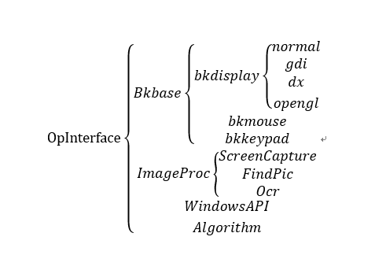

Overview
===========
OP(operator & open)是一个开源插件(类似大漠插件).主要特点:Windows消息模拟,后台截图，找图,字符识别(OCR),以及其他实用功能...使用c++编写，提供高效稳定的算法实现.源代码可编译为32/64位dll.可为32位和64位应用程序调用,支持大多数语言的调用(c++,c#,vb,delphi,...)  
  

## Download
包含32位和64位插件，tool工具以及必要的第三方库等文件  
下载地址：[https://github.com/WallBreaker2/op/releases](https://github.com/WallBreaker2/op/releases)  
也可进QQ群(979466049)下载

## Usage(用法)  
所有函数说明以及Demo可在以下链接中获得  
[op接口说明](https://github.com/WallBreaker2/op/blob/master/doc)  

## Build  
使用vs2017编译，除了DirectX SDK外,需要以下库支持：blackbone和minhook  
可使用[Vcpkg](https://github.com/Microsoft/vcpkg.git)快速安装MINHOOK库
其它额外的库可自己编译，参见[3rdparty-Lib](#3rdparty-Lib),也可进群下载
***
## Fetaure
* [Windows消息模拟](#Windows消息模拟)
* [后台截图](#后台截图)
* [图片查找](#图片查找)
* [OCR算法](#OCR算法)
* [3rdparty-Lib](#3rdparty-Lib)
* [Reference](#Reference)

#### Windows消息模拟
---
支持全局模式（normal)和Windows模式(windows)

#### 后台截图
---
前台,gdi后台;  
dx后台;d3d9,d3d10,d3d11等截图模式；  
opengl后台，支持常见模拟器（雷电，夜神）的截图，支持最小化窗口截图  
#### 图片查找
---
图像定位，支持多个图片识别，透明图片识别等功能，偏色，模糊识别
#### OCR算法  
字符识别OCR，支持超大点阵（255x255),支持多色，偏色，模糊识别,支持背景，支持系统字库，兼容大漠字库 
性能强劲，20000汉字的字库全屏（1920x1080）识别只需几百毫秒。

### 3rdparty-Lib  
---
[1].[blackbone](https://github.com/DarthTon/Blackbone.git)  
[2].[minhook](https://github.com/TsudaKageyu/minhook.git)  

### Reference
---
[1] TSPLUG源码,TC company  
[2] [Kiero](https://github.com/Rebzzel/kiero.git)  
