## 主要内容
本文主要介绍ocr算法的基本原理，主要流程以及具体实现和优化

## ocr流程
1. 将给定的RGB图像转化为灰度图像
2. 根据指定的灰度范围将灰度图像二值化
3. 使用滑动窗口将二值图像分为多个子区域
4. 对每个子区域，与字库做相识度计算，相识度符合要求的添加至结果列表
5. 对结果列表进行排序，输出

下图为流程图

## 原理
### 灰度化
由于彩色图像的RGB三个分量并不是独立的，因此转化为灰度一个分量有利于后续的处理，RGB值和灰度的转换，实际上是人眼对于彩色的感觉到亮度感觉的转换，这是一个心理学问题，有一个公式：

Grey = 0.299*R + 0.587*G + 0.114*B

根据这个公式，依次读取每个像素点的R，G，B值，进行计算灰度值（转换为整型数），将灰度值赋值给新图像的相应位置，所有像素点遍历一遍后完成转换。

一张500X500的图像转换为同样大小的灰度图需要进行25万次上述公式的计算。进行优化是很有必要的，这个简单的算法是O(n)复杂度的，应该是不能优化了（或者用并行进行优化，本文不涉及），但是Grey = 0.299*R + 0.587*G + 0.114*B有更加高效的等价形式。

在ALU中，位操作快于整数加法，整数加法快于整数乘法（快多少取决于有没有乘法电路，乘法电路的结构），整数运算又比浮点数运算快得多。

所以可以通过将浮点数运算转化为整数运算，整数运算转换为位操作进行优化

Grey = 0.299*R + 0.587*G + 0.114*B

可以转化为
Grey = (299*R + 587*G + 114*B + 500) /1000；

整数运算会截断小数部分，加上500是为了四舍五入（找两个例子便可理解），减少精度损失。

### 二值化
为了进一步提取出字符的点阵信息，需要将灰度图像二值化，将字符的灰度值范围内的点阵填充为1，其余填充为0

### 滑动窗口
首先对输入图像进行不同窗口大小的滑窗进行从左往右、从上到下的滑动。每次滑动时候对当前窗口执行相识度计算(与某个字库)。如果当前窗口得到较高相识度，则认为检测到了文字。

### 排序
提取了字符信息后，需要决定字符在字符串中的位置，所以需要排序。排序的规则为先上后下，先左后右。

## 优化
从上面的流程来看，ocr的整个流程还是比较简单的，但是算法的复杂度比较高，对于1920*1080区域，假设字库为12*12，字库总量为20000的汉字字库，则需要比较的像素次数为

(1920-11)*(1080-11)*12*12*20000=5 877 276 480 000

以1ghz的处理器来计算，需要5877s，速度实现太慢了，因此优化在ocr很有必要。

主要的优化方式有以下几种：
1. 粗定位
2. 细分类
3. 二分查找
4. 筛选